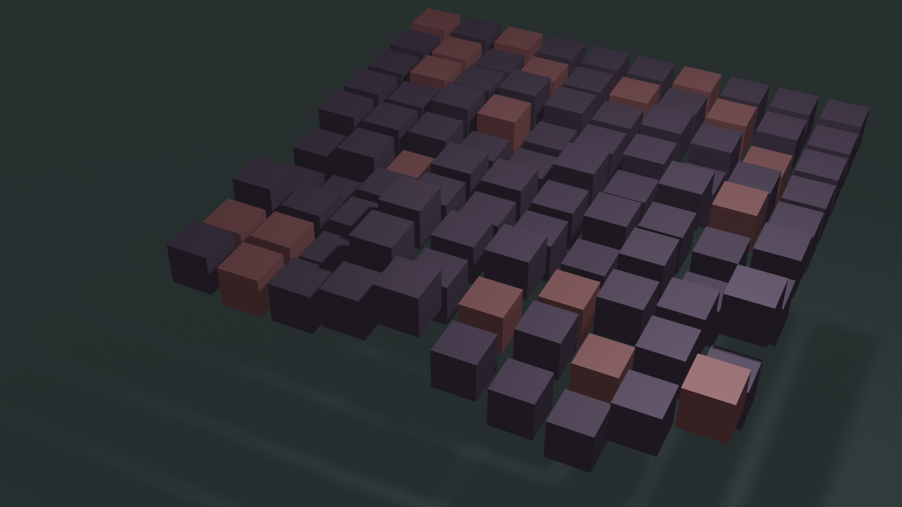

# Generativ kunst med Python og Blender

Blender er et gratis, open source program for å lage 3D modeller og 3D animasjoner. Blender har blitt brukt i produksjonen av flere filmer og dataspill, men det kan også brukes for å lage *generativ kunst*. Generativ kunst er kunst som blir generert av en dataalgoritme. Hvis man vil lage generativ kunst i Python er det flere valgmuligheter, men her skal vi altså se hvordan vi kan bruke Python til å lage generative kunstverk i Blender.

## Installere Blender og gjøre det klart for koding

Det første steget for å lage generativ kunst er å installere Blender. Det kan du gjøre [her](https://www.blender.org/download/). Når du har installert Blender er det et par ting vi bør gjøre før vi kan kode i vei. Start med å gå til instillinger ([Edit]->[Preferences]) og huk av "Developer Extras" og "Python Tooltips" i "Interface"-menyen (hvis teksten er liten kan du øke størrelsen ved å øke "Resolution Scale").

## Skrive kode

Under "Script"-fanen kan vi lage et nytt Python-script (trykk på "New"-knappen) og skrive Python-kode. Her har vi to kodeeksempler, et som lager en animasjon med firkanter som beveger seg tilfeldig rundt i rommet, og en som lager et statisk bilde.

### Animasjon av firkanter

Start med og slett alle objektene i scenen, det gjør du ved å flytte musepekeren i "Scene collection"-vinduet oppe i høyre hjørne, trykke på "a"-knappen (velg alt) etterfulgt av "x"-knappen (slett). Flytt så musepekeren inn i tekstvinduet (det i midten av "Script"-fanen) og lim inn ([Ctrl]+[v]) og kjør (play-knappen eller [Alt]+[p]) følgende kode:

```python
# Her importerer vi det vi trenger og gjør generell Python setup
# --------------------------------------------------------------
import random
from math import radians

import bpy

# Setter "seed" til random for å få samme tilfeldige tall hver gang koden kjøres
random.seed(0)

# Her setter vi hvilket filformat som skal lagres og hvor mange frames vi skal ha
bpy.context.scene.render.image_settings.file_format = 'FFMPEG'
bpy.context.scene.frame_end = 150


# Her setter vi opp scenen vår
# ----------------------------
# Her legger vi til kamera og lys
bpy.ops.object.camera_add(
    enter_editmode=False,
    location=(-2, 19, 12.5),
    rotation=(radians(52), 0, radians(-154)),
    scale=(1, 1, 1),
)
bpy.ops.object.light_add(type="POINT", radius=1, location=(0.5, 5, 10), scale=(1, 1, 1))
bpy.context.object.data.energy = 1000


for i in range(5):
    bpy.ops.mesh.primitive_cube_add(
        size=1,
        location=(random.random() * 10, random.random() * 10, 0),
        scale=(0.8, 0.8, 0.8),
    )
    cube = bpy.context.object

    cube.keyframe_insert("location", frame=0)
    for frame in range(10):
        cube.location = (random.random() * 10, random.random() * 10, 0)
        cube.keyframe_insert("location", frame=(frame + 1) * 30)
```

Når du har kjørt koden kan du lage en film ved å trykke på [Ctrl]+[F12], da vil en film lagres i "c:/tmp"-mappen. Denne filmen vil bestå av 5 kuber som svermer tilfeldig rundt i rommet. Du kan se filmen koden lagde [her](boks_sverm.mp4)

### Firkanter med farge

Med dette eksempelet skal vi lage bildet du ser under.



For å lage dette bruker vi løkker og tilfeldighet. Start med å slette alle objektene i scenen. Dette gjør du ved å flytte musepekeren til "Scene Collection" vinduet oppe i høyre hjørne og trykke på "a" (velg alt) og "x" (slett). Flytt så musepekeren tilbake til tekst-vinduet og lim inn denne koden:

```python
# Her importerer vi det vi trenger og gjør generell Python setup
# --------------------------------------------------------------
import random
from math import radians

import bpy

# Setter "seed" til random for å få samme tilfeldige tall hver gang koden kjøres
random.seed(0)

# Her oppretter vi materialene vi skal bruke
# ------------------------------------------
# Opprett materialene vi vil bruke
materials = bpy.data.materials
if "main" not in materials:
    materials.new("main")
if "accent" not in materials:
    materials.new("accent")
if "background" not in materials:
    materials.new("background")

# Vi vil ha "enkle" materialer uten fysiske egenskaper
materials["main"].use_nodes = False
materials["accent"].use_nodes = False
materials["background"].use_nodes = False

# Her setter vi fargene med en rgba-kode hvor 0 er ingen farge og 1 er maks farge
materials["main"].diffuse_color = (64 / 255, 48 / 255, 75 / 255, 1)
materials["accent"].diffuse_color = (172 / 255, 77 / 255, 83 / 255, 1)
materials["background"].diffuse_color = (74 / 255, 108 / 255, 107 / 255, 1)

# Her setter vi materialegenskapene til materialene. Disse bestemmer hvordan lys reflekteres
materials["main"].metallic = 0.5
materials["accent"].metallic = 0.5
materials["main"].specular_intensity = 0
materials["accent"].specular_intensity = 0
materials["main"].roughness = 0.6
materials["accent"].roughness = 0.6


# Her setter vi opp scenen vår
# ----------------------------
# Her legger vi til kamera og lys
bpy.ops.object.camera_add(
    enter_editmode=False,
    location=(-2.3, 22.4, 14.4),
    rotation=(radians(52), 0, radians(-154)),
    scale=(1, 1, 1),
)
bpy.ops.object.light_add(type="POINT", radius=1, location=(0.5, 5, 10), scale=(1, 1, 1))
bpy.context.object.data.energy = 1000

# Her legger vi til bakgrunnen
bpy.ops.mesh.primitive_plane_add(size=2000, location=(0, 0, -10), scale=(1, 1, 1))
bpy.ops.object.material_slot_add()
bpy.context.object.active_material = materials["background"]

# Her legger vi til alle kubene våre
for x in range(10):
    for y in range(10):
        z = random.normalvariate(1, 0.05 * y)

        bpy.ops.mesh.primitive_cube_add(
            size=1, location=(x, y, z), scale=(0.8, 0.8, 0.8)
        )
        cube = bpy.context.object

        if random.random() < 0.2:
            cube.active_material = materials["accent"]
        else:
            cube.active_material = materials["main"]
```

Du kan kjøre denne koden ved å trykke på "Play"-knappen eller [Alt]+[p]. For å lagre resultatet som et bilde trykker du på [F12] knappen (render frame) og [Alt]+[s] (lagre bilde) for å velge hvor du vil lagre bildet.
